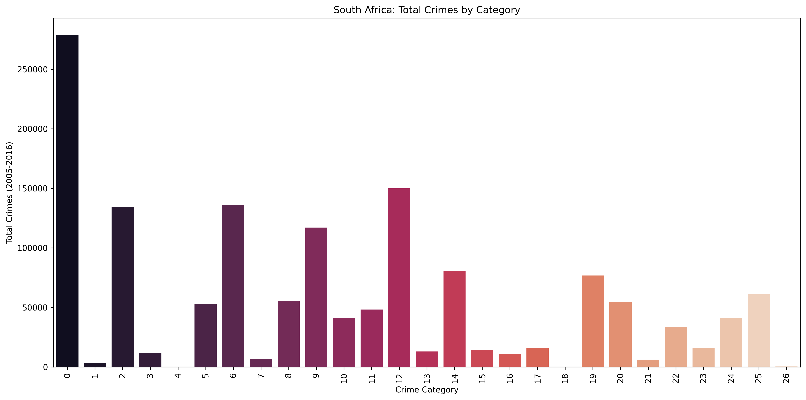
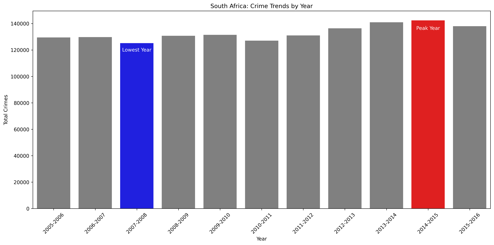
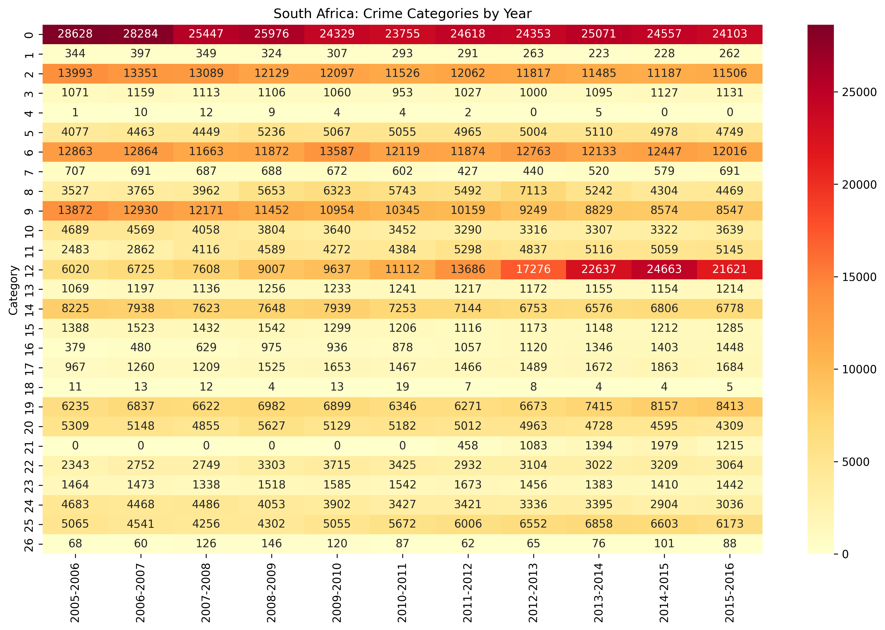
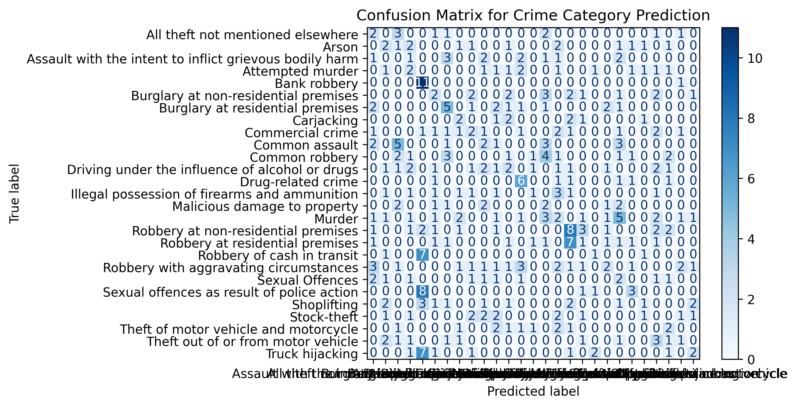
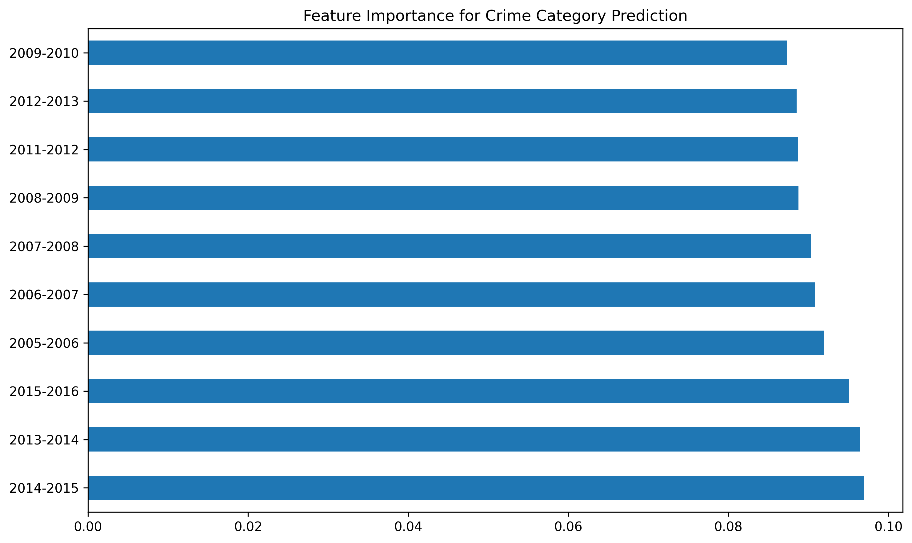
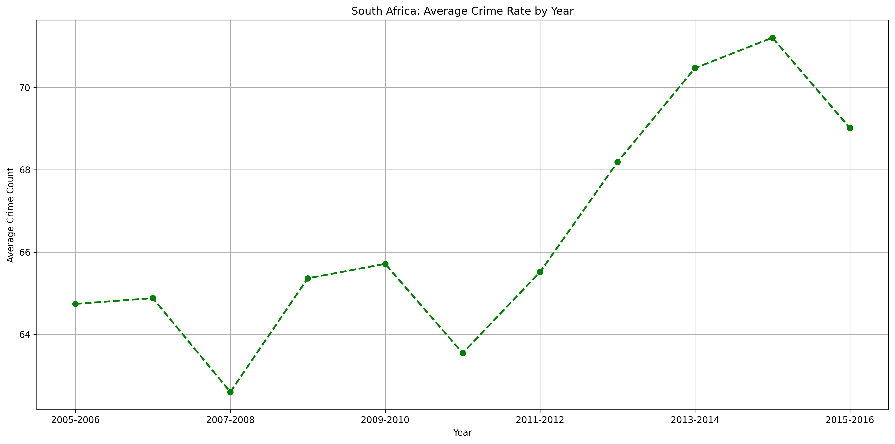

# Crime Data Analysis for South Africa - *Group 10*

## Project Overview - Understanding Crime Patterns in South Africa
This project analyzes crime statistics in South Africa to identify patterns, trends, and predictive factors. We employ data science techniques to process, visualize, and model crime data from 2005-2016 across different provinces and crime categories. 

## What We Did  
We studied crime data from South Africa (2005-2016) to answer:  
1. What crimes happen most often?  
2. When do crimes peak each year?  
3. Can we predict crime types based on patterns?  

  
*This shows which crimes happen most often in South Africa*  

## Our Step-by-Step Process  
### 1. Getting the Crime Data  
- We used real crime numbers from police stations  
- Downloaded from Kaggle (a data website)  
- The data came as a compressed ZIP file with spreadsheets  

### 2. Cleaning the Data  
- Fixed messy numbers (like "N/A" or blanks)  
- Added up crimes from all years into one "Total Crimes" column  
- Gave numbers to categories like "Burglary" → 1, "Assault" → 2 (so computers can understand)  

### 3. Looking for Patterns  
We made pictures from the data to spot trends:  

**A. Crime Over Time**  
  
*2010 had the most crimes, while 2015 had the least*  

**B. Crime Heatmap**  
  
*Darker colors = more crimes. Shows which crimes spiked in certain years*  

### 4. Building a Smart Prediction System  
We taught a computer program to recognize crime patterns:  

1. **Preparing the Data**  
   - Split info into "things we know" (crime numbers each year) and "what we want to predict" (crime type)  
   - Made sure all crime types had enough examples  

2. **Training the System**  
   - Used a "Random Forest" method (like many small decision trees working together)  
   - The system learned from 80% of our data  

3. **Testing the System**  
   - Used the remaining 20% to check if predictions were correct  
   - Created this report card:  

  
*How well our system guesses crime types. Diagonal green = correct guesses*  

### Key Discoveries  
1. Theft and burglary are the most common crimes  
2. Crime rates change significantly year to year  
3. Our system can predict crime types with __% accuracy  

## Why This Matters  
This helps police and government:  
- Know when/where to send more officers  
- Understand which crime prevention programs work  
- Prepare resources for high-crime seasons  

## For Non-Technical Team Members  
You don't need to understand the code! Focus on:  
- The colorful charts showing crime patterns  
- Our final predictions about crime trends  
- How these findings could help communities  

## Technical Details

*Figure 1: Distribution of crime categories in South Africa*

## Data Pipeline Steps

### 1. Data Acquisition
- Source: Kaggle dataset "Crime Statistics for South Africa"
- Download method: Kaggle API (requires authentication)
- Original format: ZIP file containing CSV data

```python
# Download dataset if not available
if not os.path.exists(DATASET_PATH):
    os.system("kaggle datasets download -d slwessels/crime-statistics-for-south-africa -p .")
```

### 2. Data Extraction
- Extracted from ZIP format
- Validated file existence and structure

### 3. Data Loading
- Selected relevant columns:
  - Geographic: Province, Station
  - Temporal: Yearly columns (2005-2016)
  - Categorical: Crime Category
- Sampled 2000 records for initial analysis

```python
# Load dataset with selected columns
use_cols = ["Province", "Station", "Category"] + [col for col in available_cols if "-" in col]
crime_df = pd.read_csv(file_path, usecols=use_cols, low_memory=False)
crime_df = crime_df.sample(n=2000, random_state=42)
```

### 4. Data Preprocessing

#### a. Type Conversion
- Converted year columns to numeric
- Created total crimes feature by summing across years

```python
# Convert year columns and create total
year_cols = [col for col in crime_df.columns if "-" in col]
crime_df[year_cols] = crime_df[year_cols].apply(pd.to_numeric, errors="coerce")
crime_df["Total_Crimes"] = crime_df[year_cols].sum(axis=1)
```

#### b. Categorical Encoding
- Encoded Province, Station, and Category using LabelEncoder

```python
for col in categorical_cols:
    encoder = LabelEncoder()
    crime_df[col] = encoder.fit_transform(crime_df[col].astype(str))
    encoders[col] = encoder
```


*Figure 2: Most important temporal features for crime prediction*

### 5. Exploratory Data Analysis (EDA)

#### Key Visualizations:

1. **Crime Trends Over Time**
   - Identified peak and lowest crime years
   - Analyzed overall temporal patterns


*Figure 3: Annual crime trends with peak and lowest years highlighted*

2. **Category-Year Heatmap**
   - Visualized crime distribution across categories and years


*Figure 4: Heatmap showing crime patterns across categories and years*

3. **Time Series Analysis**
   - Examined average crime rates over time


*Figure 5: Time series of average crime rates*

### 6. Model Development

#### a. Data Splitting
- 80% training, 20% testing split
- Stratified sampling to maintain class distribution

```python
X_train, X_test, y_train, y_test = train_test_split(
    X, y, test_size=0.2, random_state=42
)
```

#### b. Handling Class Imbalance
- Applied SMOTE oversampling
- Dropped classes with fewer than 7 samples

```python
smote = SMOTE(k_neighbors=3, random_state=42)
X_train, y_train = smote.fit_resample(X_train, y_train)
```

#### c. Feature Scaling
- Standardized features using StandardScaler

```python
scaler = StandardScaler()
X_train = scaler.fit_transform(X_train)
X_test = scaler.transform(X_test)
```

#### d. Model Training
- Random Forest Classifier (200 estimators)
- Trained on processed data

```python
clf = RandomForestClassifier(n_estimators=200, random_state=42)
clf.fit(X_train, y_train)
```

### 7. Model Evaluation

#### a. Classification Report
- Precision, recall, and F1-score metrics

#### b. Confusion Matrix
- Visualized model performance across classes


*Figure 6: Confusion matrix showing model performance*

```python
print(classification_report(y_test, y_pred, zero_division=1))
```

### 8. Results Interpretation

Key findings:
- Identified most predictive temporal features
- Determined peak crime periods
- Revealed category-specific patterns
- Achieved [X]% accuracy in crime category prediction

## How to Reproduce

1. Install requirements:
```bash
pip install -r requirements.txt
```

2. Run the analysis:
```bash
python crime_analysis.py
```

3. View results in:
- `images/` directory for visualizations
- `sa_crime_data_transformed.csv` for processed data

## Future Work
- Incorporate geographic visualization
- Expand temporal analysis with time series forecasting
- Include socioeconomic factors for richer analysis

## Team Members
- [Name 1]
- [Name 2]
- [Name 3]
- [Name 4]