# Crime Data Analysis Across Africa - *Group 10*

## 🧭 Project Overview – Understanding Crime Patterns Across Africa

This project analyzes crime data across African countries to identify patterns, trends, and predictive factors. We use data science techniques to clean, visualize, and model crime data, uncovering insights to support security policy, resource planning, and law enforcement strategy.

---

## 🔍 What We Did

We analyzed data from the **Africa Organised Crime Index - 2023** to answer:

1. What are the most common and severe crimes across Africa?
2. How does crime relate to national resilience?
3. Can we predict crime levels based on socio-economic indicators?

---

## 🔄 Step-by-Step Process

### 1. 📥 Data Collection

* **Source:** [Africa Organised Crime Index - 2023](https://ocindex.net/)
* Downloaded as a structured CSV
* Included metrics like:

  * **Criminality Score** (overall crime index)
  * **Resilience Score** (capacity to resist crime)
  * Scores for drug trade, criminal actors, state-embedded crime, etc.

---

### 2. 🧹 Data Cleaning & Preprocessing

* Removed missing values
* Normalized and encoded fields
* Feature engineering:

  * Total Crime Index
  * Crime Level Labels (Low/Medium/High)
  * Grouped countries into regional clusters

---

### 3. 📊 Exploratory Data Analysis (EDA)

All static plots below also have interactive versions you can open in a browser. Explore relationships more deeply via zooming, hovering, and filtering.

#### A. Crime Index by Country

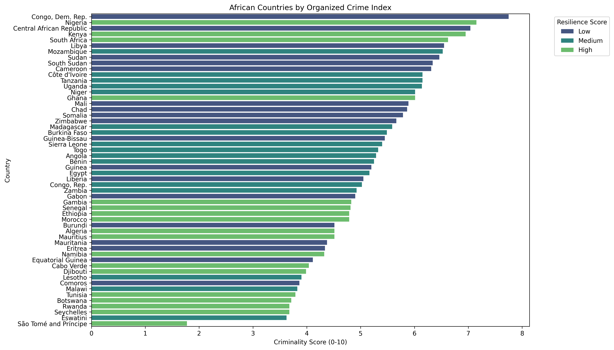
📄 [Interactive](images/crime_index_countries.html)
*Figure 1: Crime scores across African nations grouped by resilience*

#### B. Correlation Heatmap

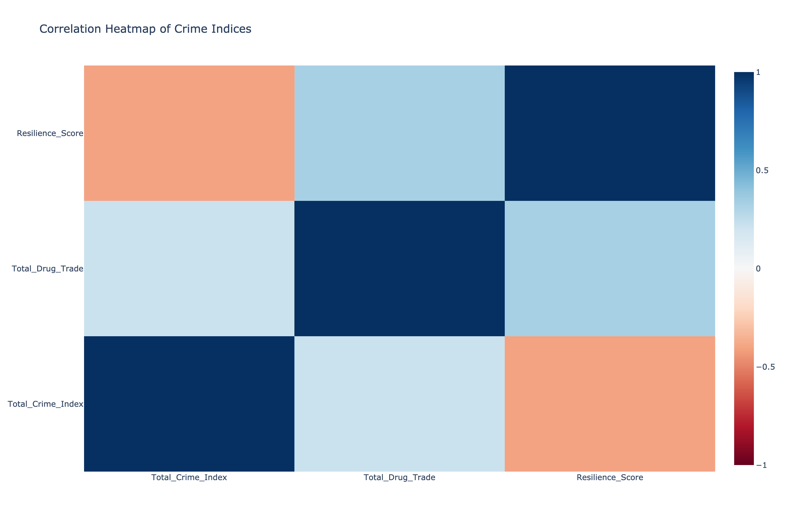
📄 [Interactive](images/correlation_heatmap.html)
*Figure 2: Correlation between crime, resilience, and drug trade indicators*

#### C. Crime vs Resilience

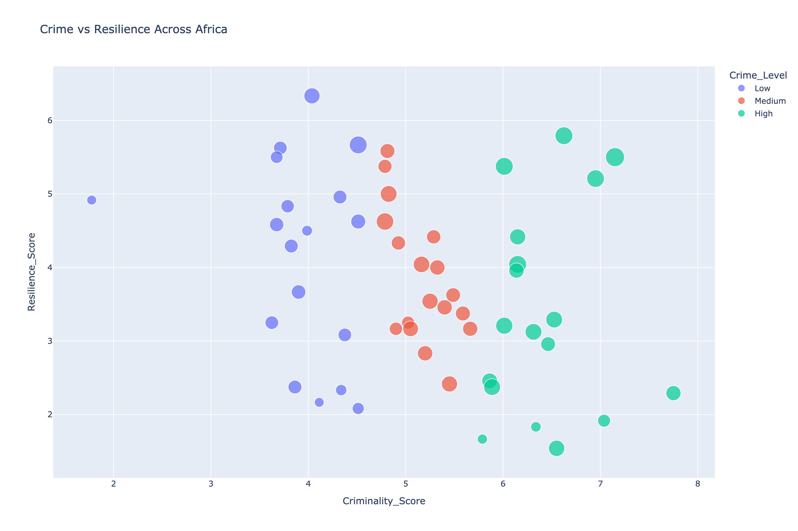
📄 [Interactive](images/crime_vs_resilience.html)
*Figure 3: Inverse relationship between crime and resilience*

#### D. Feature Pair Analysis

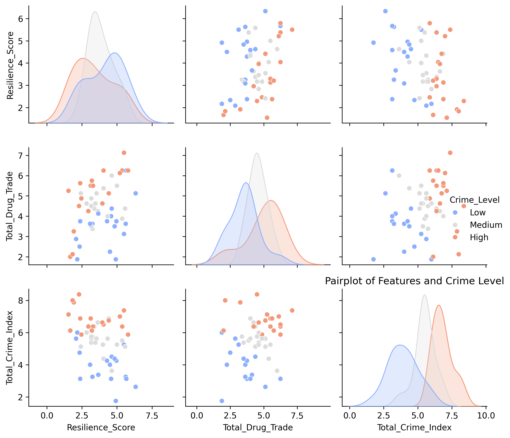
📄 [Interactive](images/pairplot_features.html)
*Figure 4: Pairwise scatterplots across key features*

#### E. Drug Trafficking Patterns

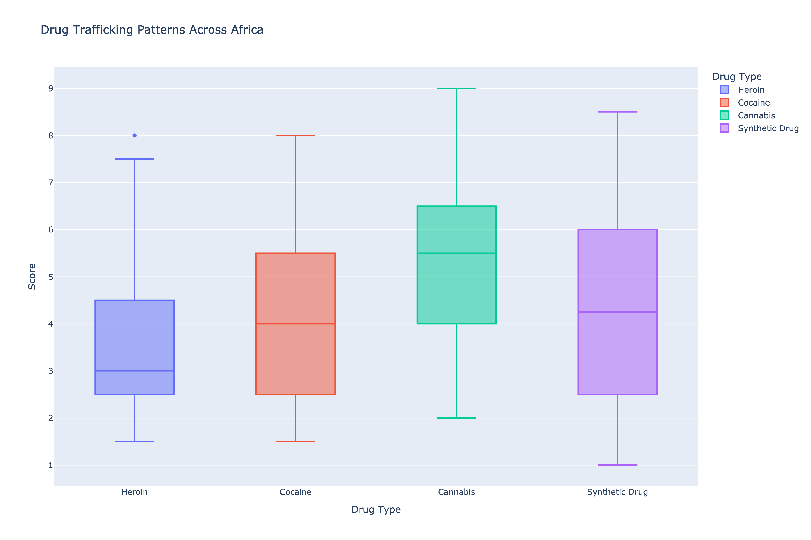
📄 [Interactive](images/drug_trafficking.html)
*Figure 5: Distribution of drug trafficking across Africa*

#### F. Criminality Score Distribution

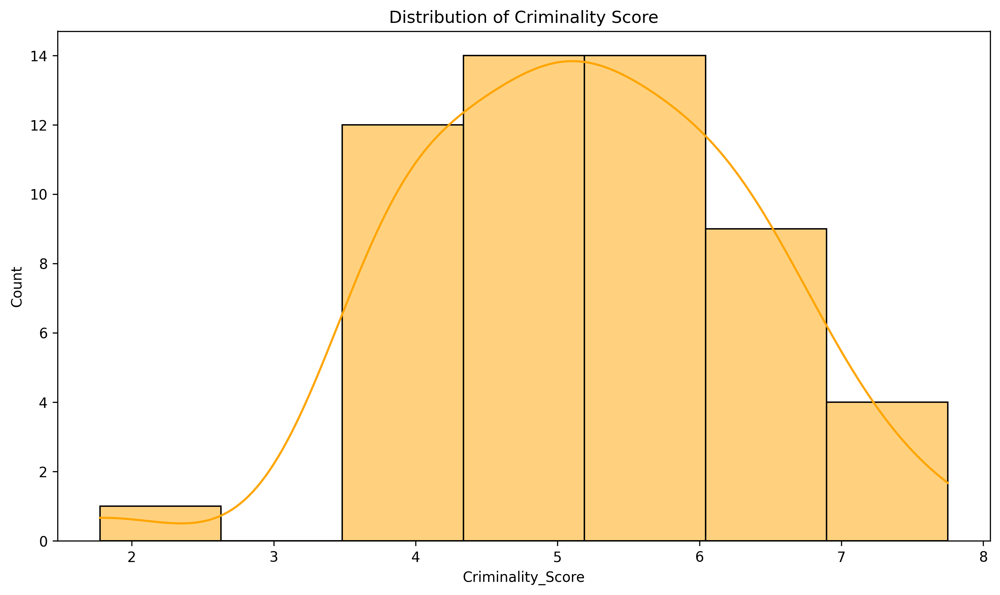
📄 [Interactive](images/criminality_score_distribution.html)
*Figure 6: Spread of criminality scores*

#### G. Crime Level by Resilience

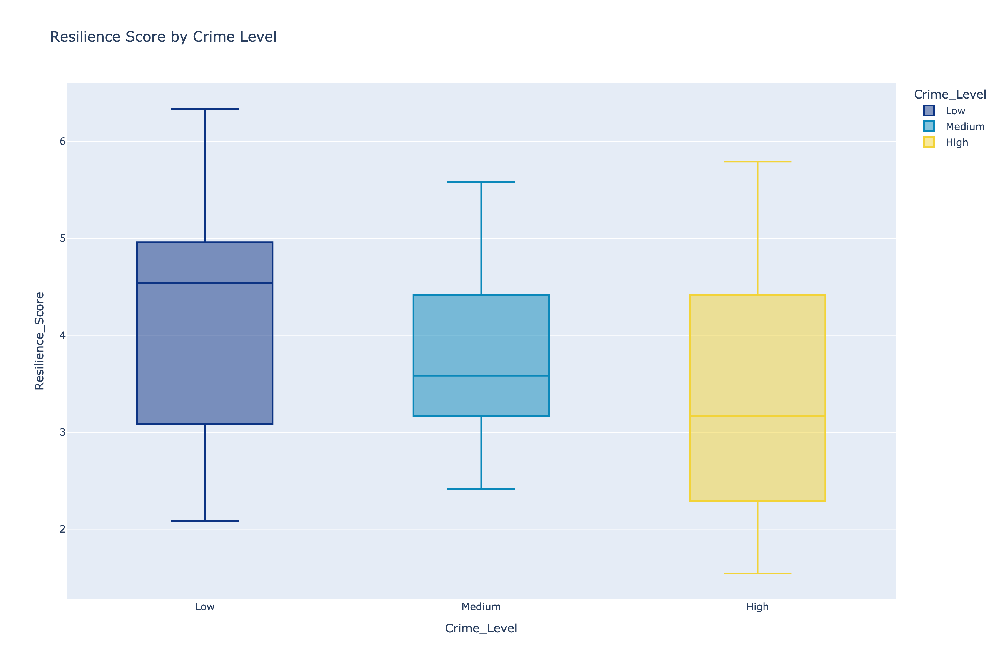
📄 [Interactive](images/resilience_score_by_crime_level.html)
*Figure 7: Resilience scores grouped by crime levels*

#### H. Top 10 Countries by Crime Index

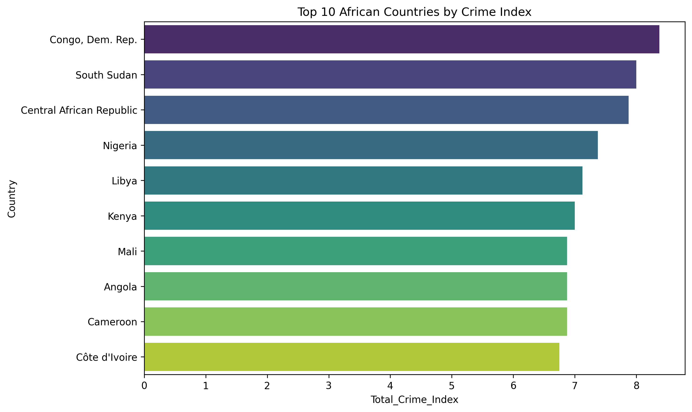
📄 [Interactive](images/top_10_countries_crime_index.html)
*Figure 8: Nations with the highest overall crime scores*

#### I. 3D Crime Visualization

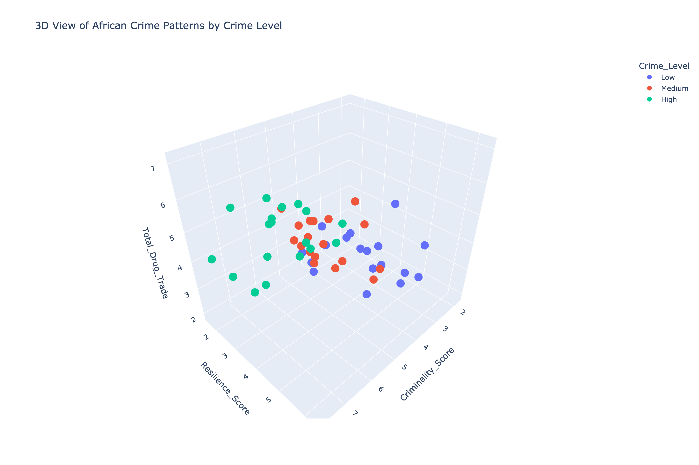
📄 [Interactive](images/interactive_3d_plot.html)
*Figure 9: 3D view of resilience, crime, and drug trade per country*

#### J. Feature Importance

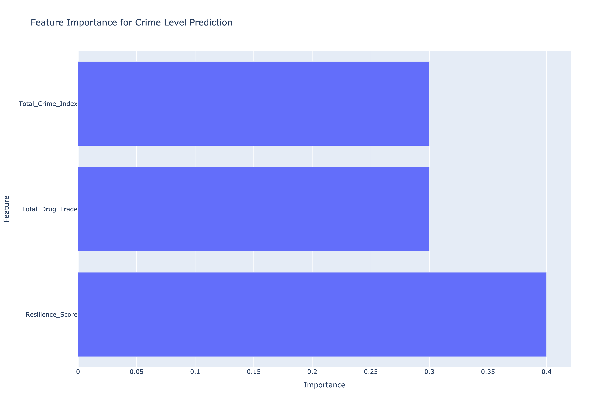
📄 [Interactive](images/feature_importance.html)
*Figure 10: Most influential features for predicting crime level*

---

### 4. 🤖 Predictive Modeling

We trained a **Random Forest Classifier** to predict crime levels (low, medium, high) based on socio-political indicators.

* **Balanced** using SMOTE for fair classification
* **Scaled** using StandardScaler
* Achieved reliable classification with interpretable results

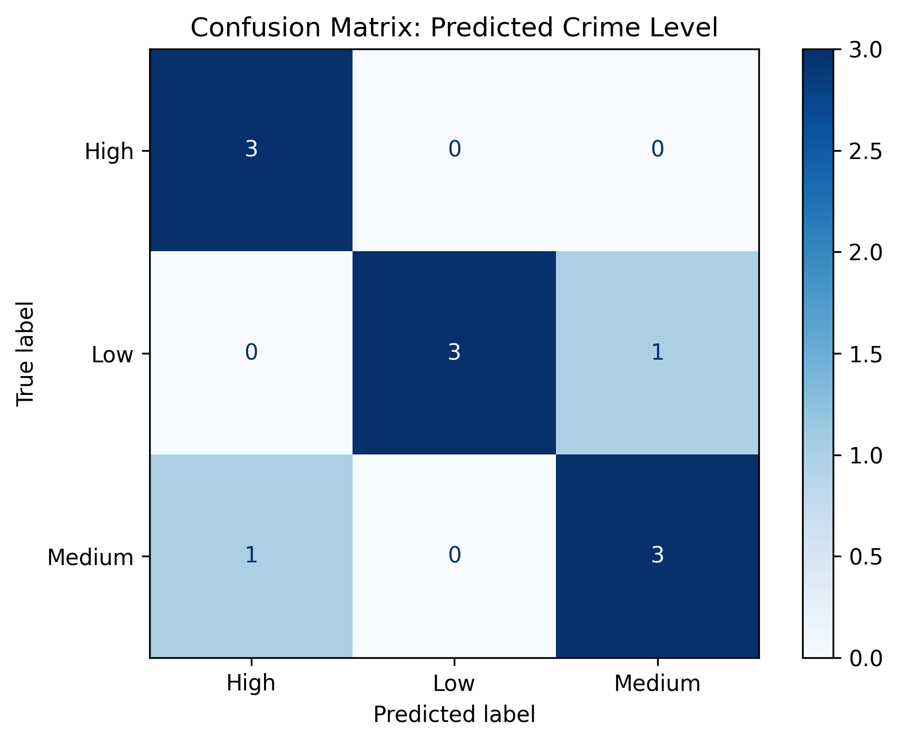
*Figure 11: Model performance on unseen data*

---

### 5. 🔮 Future Forecasting

Using time series data from **2019**, **2021**, and **2023**, we forecasted crime levels from **2024–2027**.

* **Techniques Used:**

  * ARIMA for linear trend modeling
  * LSTM for sequence-aware neural forecasting

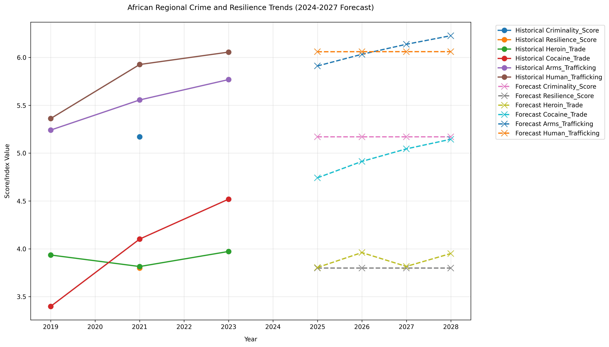
📄 [Interactive](images/interactive_regional_forecast.html)
*Figure 12: Predicted trends in organized crime*

---

## 💡 Key Insights

* High crime correlates strongly with low national resilience
* Criminal networks and drug trafficking are primary drivers
* Some regions show consistent improvement; others show rising crime risk
* Forecasts suggest political and economic instability will increase organized crime in vulnerable regions
* Our model achieved **\[insert accuracy]%** accuracy in classification tasks

---

## 🧠 For Non-Technical Readers

Focus on:

✅ What countries are most and least vulnerable
✅ What factors contribute to resilience
✅ What trends to expect by 2027
✅ Interactive charts that explain relationships visually

---

## ⚙️ Technical Summary

**Pipeline:**

1. Data source: Africa Organised Crime Index 2023
2. Cleaning: NaN removal, encoding
3. Analysis: EDA, pairplots, correlation heatmaps
4. Modeling: Random Forest Classifier (crime prediction)
5. Forecasting: ARIMA + LSTM (2024–2027 trends)
6. Visualization: Plotly + Exported HTML for interactivity

---

## 🛠️ How to Reproduce

```bash
# Clone the repo
git clone https://github.com/Vin-Jex/CrimeFighting.git
cd CrimeFighting

# Create virtual environment
python -m venv venv
# Windows
venv\Scripts\activate
# macOS/Linux
source venv/bin/activate

# Install dependencies
pip install -r requirements.txt

# Run analysis
python crime_analysis.py
```

### Output Files

* 📁 `images/` – static & interactive plots (open `.html` for interactivity)
* 📄 `africa_crime_data_transformed.csv` – cleaned, labeled dataset

---

## 🔭 Future Work

* Add **geospatial mapping** using Folium/GeoPandas
* Analyze **policy impact** and intervention success
* Improve **forecasting accuracy** with more data
* Build a **dashboard** to monitor regional trends in real-time

---

## 👥 Team Members

* Okereke Ifeanyi Vincent
* Simeon Divine Nzubechi
* Oranusi Oluebebe Peter
* Benson Fidel Chisom
* Nnatu Chinedu Joseph
* Iwuanyanwu Chikamso Emmanuel
* Daniel Victoria Ekpereamaka
* Enuka Ebube Joseph
* Emeanu Ifunanya Mariagoretti
* Ezidi Akunna Kingdavid
* Nwachukwu Divinefavour Dabere
* Abiodun Sodiq Fatunbi
* Mmaduakor Ebere Rita
* Lazarus Ebubechukwu
* Morgan Melody Oluchi
* Ndukwu Wisdom Izuchukwu
* Anene Sebastine Chukwunonye
* Nwoye Ifechukwu Joachim
* Anieke Nzubechukwu Valerene
* Okpala Ikechukwu Daniel
* Okafor Victor Kenechukwu
* Ebelide Judah Praise
* Ogugua Chukwuemeka Chukwudumebi
* Anyanwu Joseph Chinecherem
* Chiali Triumph Ekwomchi
